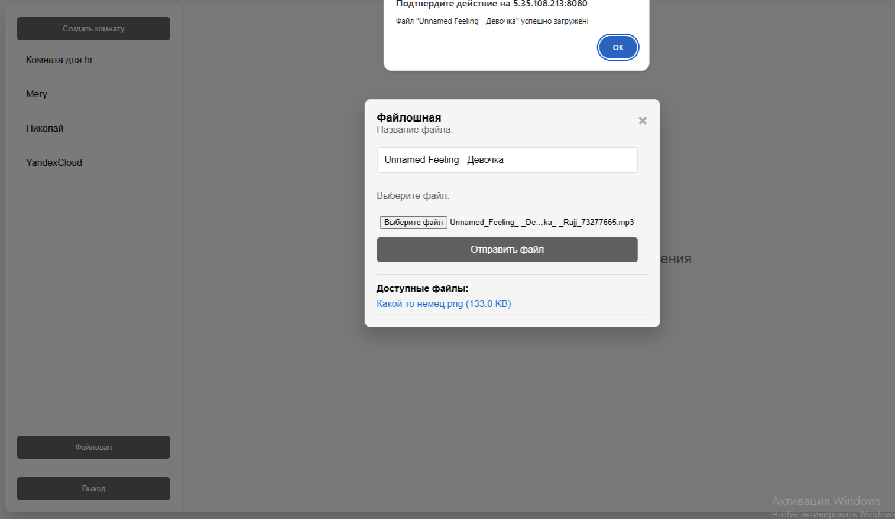
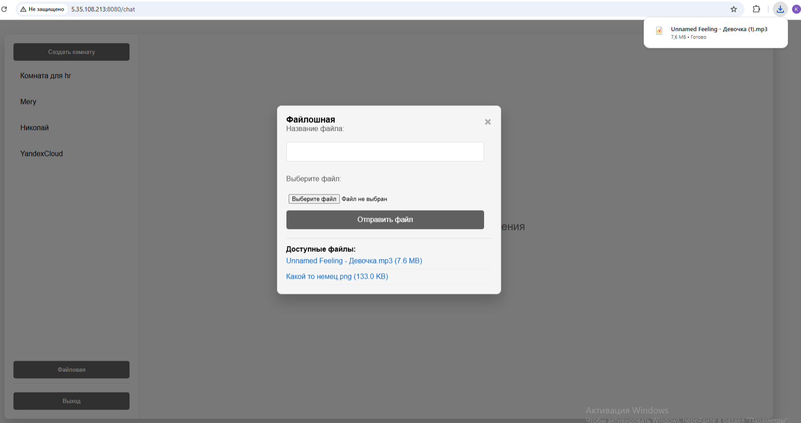

<h2 style="font-size: 1.5em;">Fast api чат с комнатами и файлообменником</h2>

#Скопировать файл env в файл среды .env

cp env .env

app/static/js/chat.js путь строка 133: заменить адрес ip на адрес своего сервера для работы websocket

docker-compose up --build

http://5.35.108.213:8080/chat/login адрес в моем случае, в вашем ваш ip. Если яндекс не прервал прерываемый сервер на нем щас работает. Если прервал я перезапущу. Файл скачивается при нажатии на его ссылку

